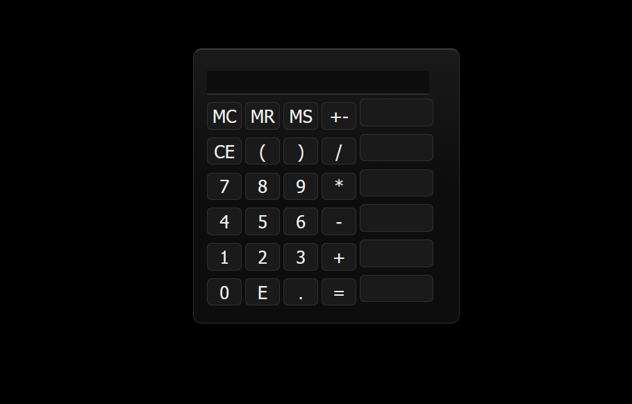

# 🧮 JavaScript Calculator

This project is a calculator built with **vanilla HTML, CSS and JavaScript**.  
It was created as a learning project to better understand DOM manipulation, event handling, and UI logic without using any external libraries or frameworks.

## 🔧 Technologies

- HTML5  
- CSS3  
- JavaScript (Vanilla)

## ✨ Features

- Basic arithmetic operations (+, −, ×, ÷)
- Memory functions:
  - **MC** (Memory Clear)
  - **MR** (Memory Recall)
  - **MS** (Memory Store)
- **Plus / Minus (±)** button to switch the sign of a number
- **Editable buttons**:
  - Some buttons can be edited with a double click after entering the edit mode (**E** button)
  - You can enter any function supported by the [eval()](https://developer.mozilla.org/en-US/docs/Web/JavaScript/Reference/Global_Objects/eval?utm_source=chatgpt.com) function in JavaScript, here are a few examples:
    - Math.abs(x) → absolute value
    - Math.sqrt(x) → square root
    - Math.log10(x) → logarithm base 10
    - Math.cos(x) → cosine (radians)
    - Math.sin(x) → sine (radians)

## 🛠️ The Process

The project started with a simple calculator layout and basic operations.  
Step by step, new features were added, such as memory management and button customization.

Special attention was given to:
- Separating HTML structure, CSS styling, and JavaScript logic
- Managing different interaction states (hover, active, edit mode)
- Handling user input safely and consistently

## 📚 What I Learned

- How to manipulate the DOM dynamically with JavaScript
- How to manage events (`click`, `dblclick`, hover states)
- How browser default styles affect UI elements and how to reset them
- How to organize a small front-end project cleanly
- How to design interactive UI behavior without relying on frameworks

## ▶️ How to Run the Project

1. Clone the repository or download it as a ZIP file  
2. Open the project folder  
3. Open `index.html` in any modern web browser (Chrome, Firefox, Edge, etc.)

No installation or dependencies are required.

## 🖼️ Screenshot

